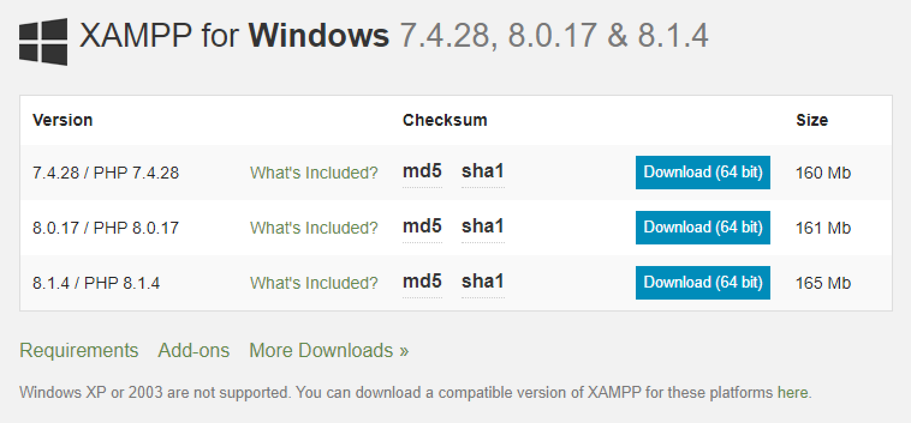
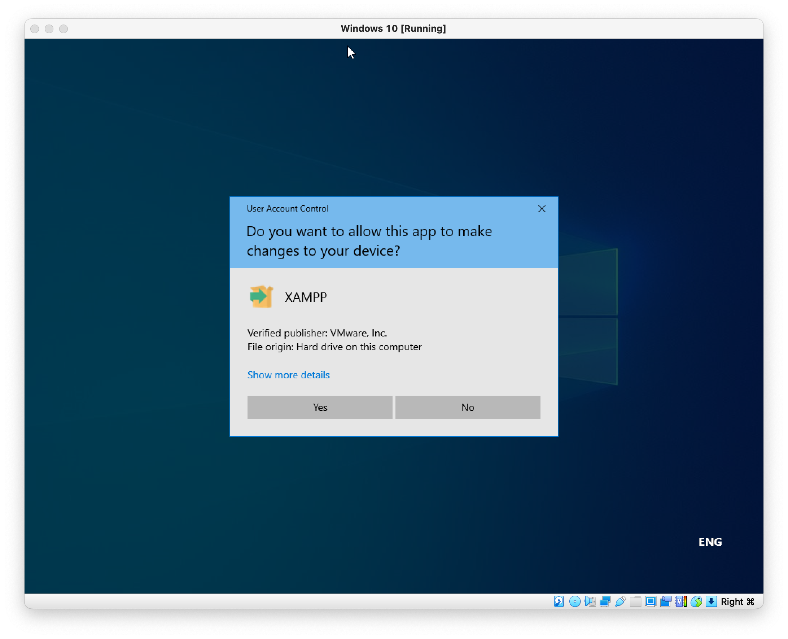
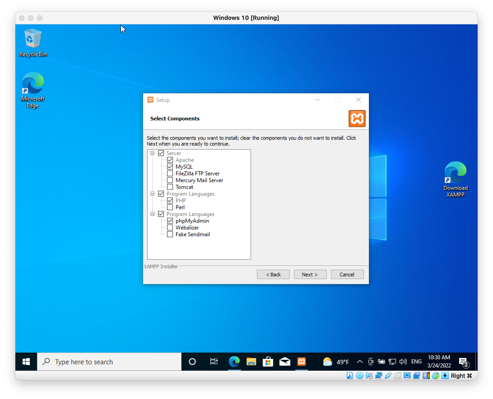
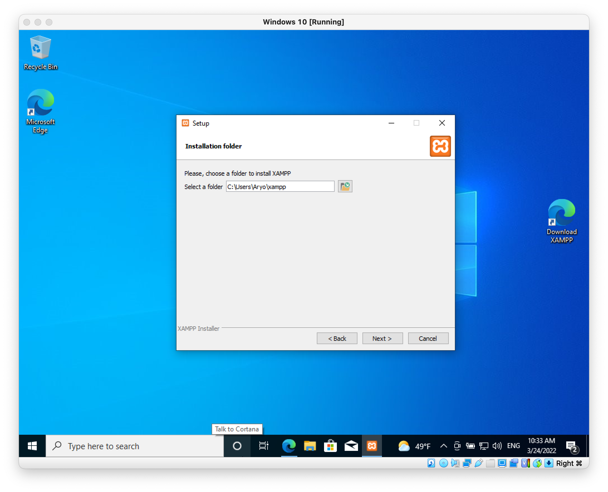
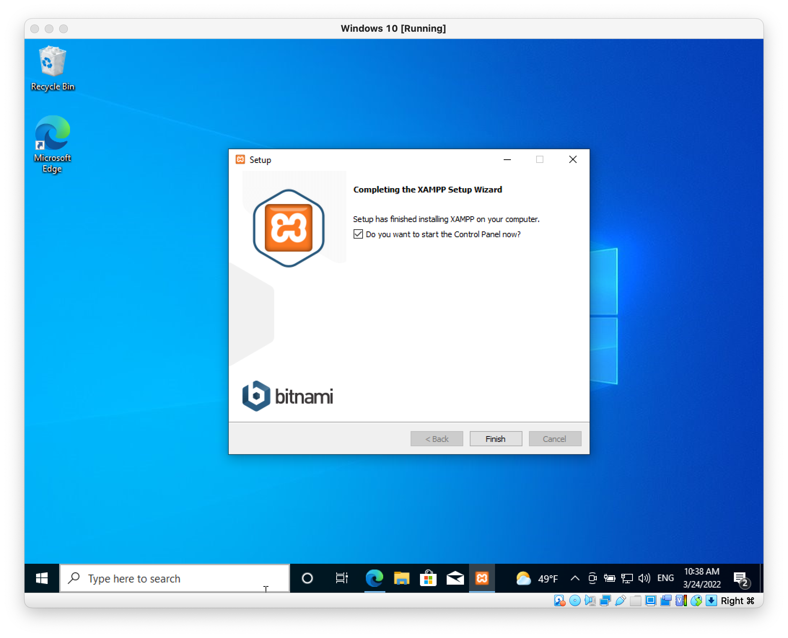
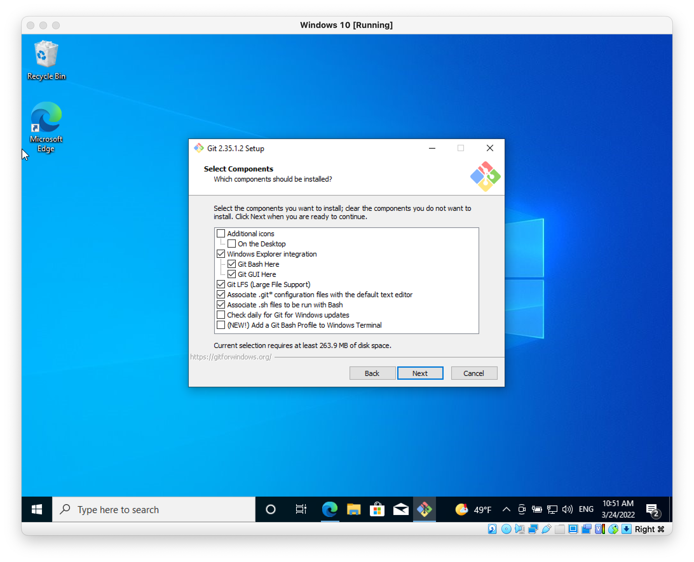

# Create Development Environment-Windows


## Download XAMPP

Download from the following URL:

````http
https://www.apachefriends.org/download.html
````



Download XAMPP with PHP 8.1.x.


## Install XAMPP

Start the XAMPP installer previously downloaded.



Select the following necessary packages:



Install xampp under your User home directory:



Start the xampp Control Panel when the installer finish.




## Install Visual Studio Code


## Install Git

Download git from the following page:

````http
https://git-scm.com/download/win
````

Download the latest version of 64-bit git. Once the download complete, start the git installer and select the following components.




## Changing The Document Root Directory of Apache

By default, the document root of Apache web server of XAMPP is at:

````
xampp/htdocs
````

The directory already have several files, so we need to change the document root to different directory, let's say `kb`.

Create `kb/` directory inside `xampp/htdocs/` directory.


TODO: Edit the Apache configuration file:


## Cloning The Kit-Build System Source Code


From the Git terminal execute the following command: 

````bash
git clone --single-branch -b master https://github.com/aryoxp/kbfira.git .
````


## Test The Kit-Build System Home Page

Open the Kit-Build system Home Page from the following URL:

````http
http://localhost/kb/index.php/home
````


## Create New Database Using PhpMyAdmin

Database name: `kbv2-fira`

Collation: `utf8mb4_general_ci`

### Add user for database

Username: `kbv2user`

Password: `kbv2userpass`