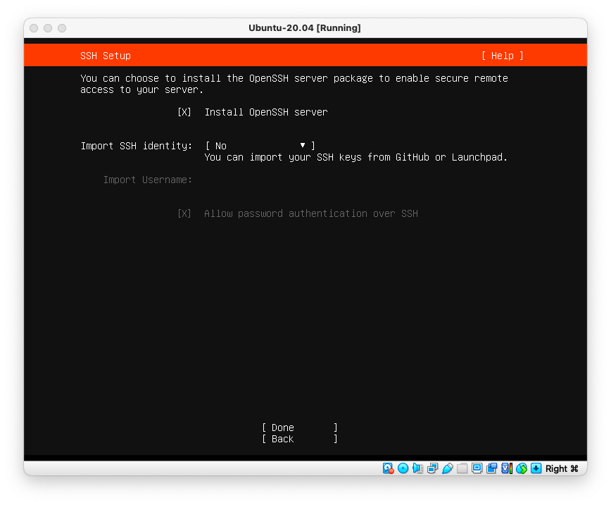
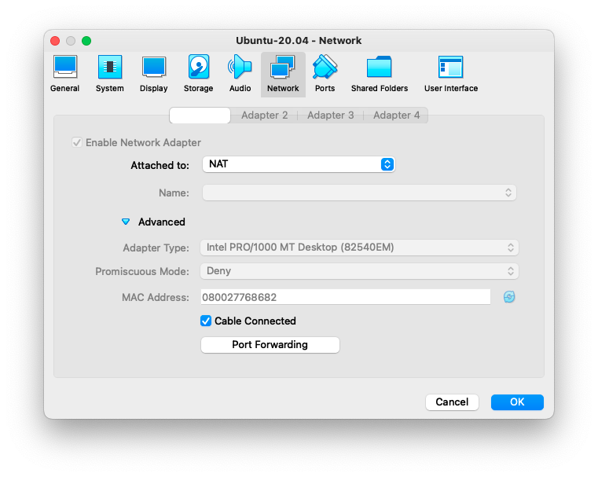
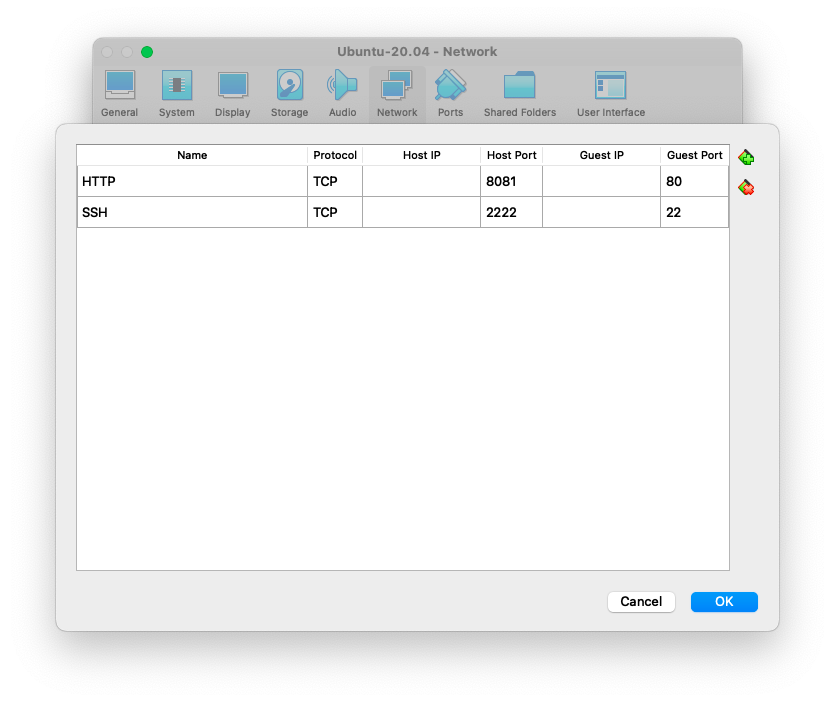
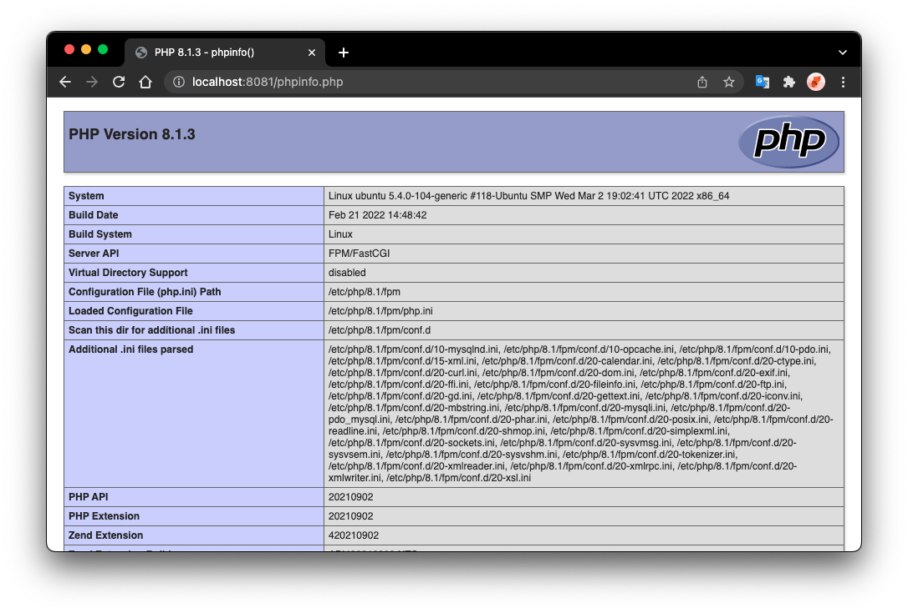
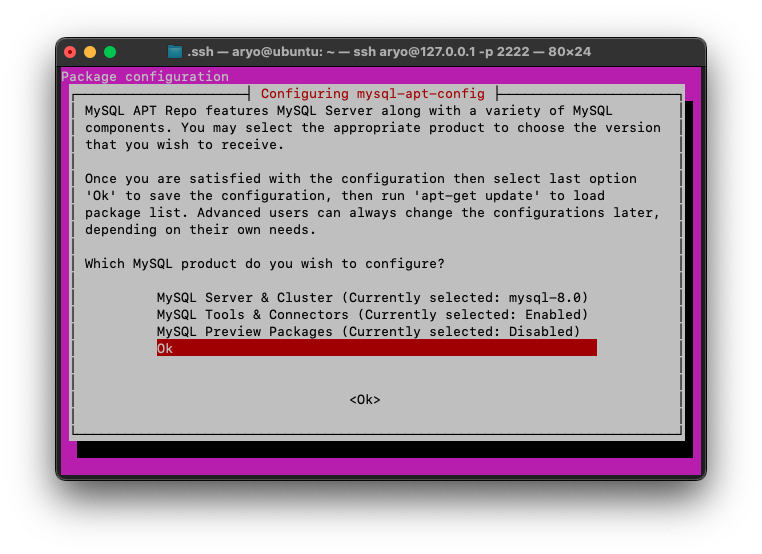
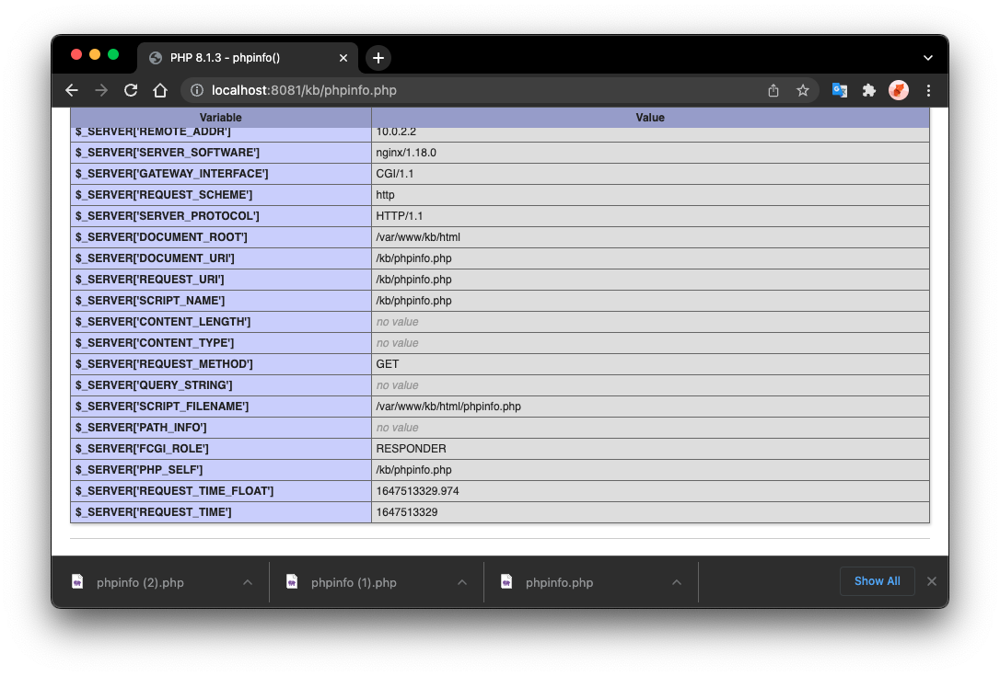
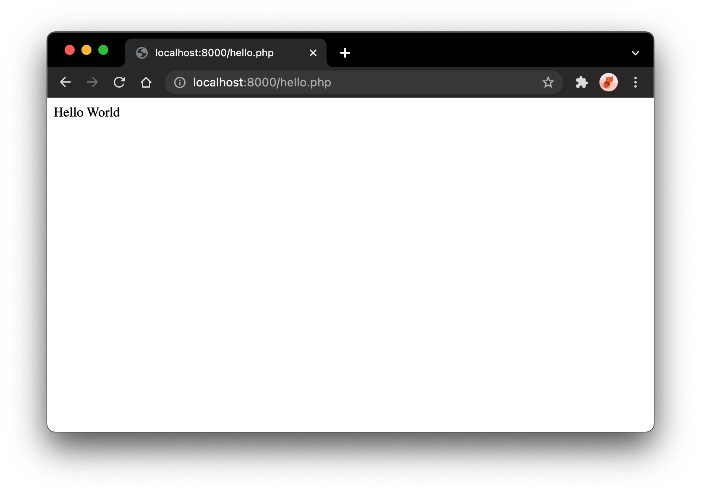

# Install Ubuntu Server: The Operating System


This document will explain how to setup a server with Ubuntu Server for Kit-Build system. Basic understanding on Linux environment, command, and shell scripting is required.

For this document, the install will be a server of a VirtualBox virtual machine.

To begin with the installation, follow the following steps:

1. Download the ISO of Ubuntu Server v20.04.04 LTS (or a newer version of LTS) from the following URL: 
   
   ````http
   https://ubuntu.com/download/server
   ````
   
1. Install Ubuntu Server OS, using the downloaded Ubuntu Server ISO image with *default* configuration and choose to Install OpenSSH when asked. 
   
   *Please take a note on **username** and **password** used during installation*, 
   
   In this document, the following credentials for the Ubuntu server installation are used:
   
   - name: **Aryo**
   - server name: **ubuntu**
   - username: **aryo**
   - password: **123**
   
   Please refer to your own server configuration for the upcoming steps that uses **sudo** command.
   
   
   
   Continue the installation process until the installation of Ubuntu Server is completed.
   
   
   
2. Reboot the server by choosing the [**Reboot Now**] button.

4. Login with username and password that were given during Ubuntu Server installation.


# Install and Configure Ubuntu Server Applications


## Install Net Tools

1. Install net-tools

   ````shell
   sudo apt install net-tools
   ````


## Install Nginx

Defined settings:

- Web server root directory: `/var/www/html`


1. Install Nginx Web Server

   ````shell
   sudo apt install nginx
   ````

2. Check Nginx server status after install. Nginx is running when Active status is `active`.

   ````shell
   systemctl status nginx
   ● nginx.service - A high performance web server and a reverse proxy server
        Loaded: loaded (/lib/systemd/system/nginx.service; enabled; vendor preset:>
        Active: active (running) since Thu 2022-03-17 06:20:39 UTC; 3min 56s ago
          Docs: man:nginx(8)
      Main PID: 2638 (nginx)
         Tasks: 2 (limit: 2274)
        Memory: 5.2M
        CGroup: /system.slice/nginx.service
                ├─2638 nginx: master process /usr/sbin/nginx -g daemon on; master_>
                └─2639 nginx: worker process
   ````


### Managing Nginx Server Process

To stop your web server, type:

```bash
sudo systemctl stop nginx
```

To start the web server when it is stopped, type:

```bash
sudo systemctl start nginx
```

To stop and then start the service again, type:

```bash
sudo systemctl restart nginx
```

If you are only making configuration changes, Nginx can often reload without dropping connections. To do this, type:

```bash
sudo systemctl reload nginx
```

By default, Nginx is configured to start automatically when the server boots. If this is not what you want, you can disable this behavior by typing:

```bash
sudo systemctl disable nginx
```

To re-enable the service to start up at boot, you can type:

```bash
sudo systemctl enable nginx
```


## Install PHP 8 PHP-FPM

Defined settings:

- The version of PHP to use is PHP 8.x


1. Check the configured PHP version to install

   ````sh
   sudo apt list php
   Listing... Done
   php/focal 2:7.4+75 all
   ````

   The current configuration state PHP 7.4 instead of PHP 8

   If version 8 is not yet available, install the `ondrej` *Personal Package Archive* (PPA). This archive, which was developed by Ondřej Surý, provides access to all recent versions of PHP.

2. Add the `ondrej/php` repository using APT.

   ```sh
    sudo add-apt-repository ppa:ondrej/php
   ```

3. Add the `ondrej` PPA for NGINX, use the following command:

   ```sh
    sudo add-apt-repository ppa:ondrej/nginx
   ```

4. Upgrade the new packages.

   ```sh
    sudo apt update
   ```

5. Run the `sudo apt list php` command to see the default version of PHP. If the default version is now 8.0, use `php` throughout the following instructions. Otherwise, include the version when specifying the package name, for example, `php8.0` or `php8.0-mysql`.

   ````sh
   $ sudo apt list php
   Listing... Done
   php/focal 2:8.1+92+ubuntu20.04.1+deb.sury.org+2 all
   N: There is 1 additional version. Please use the '-a' switch to see it
   ````

   As it can be seen, the configured PHP repository has now pointed to PHP 8.1

6. Stop Apache Web Server if exists. Because we are going to use Nginx for the web server instrad of Apache.

   The procedure to install PHP on NGINX is very similar to the procedure for Apache. If Apache is installed on the system, the PHP installation process might try to activate it. If this happens, stop Apache with the command:

   ````sh
   sudo systemctl disable --now apache2
   ````

7. Install the `php-fpm` module.

   ```sh
   sudo apt install php-fpm
   ```

   > Install the `php-fpm` module, but do not install `php`. If the `php` module is installed first, it will configure the Apache server instead of NGINX. The `php-fpm` package contains all core modules for PHP.

8. Install any additional PHP packages.

   ```sh
   sudo apt install php-common php-mysql php-cgi php-mbstring php-curl php-gd php-xml
   ```

9. Confirm PHP 8.0 has been installed.

   ```sh
   $ php -v
   PHP 8.1.3 (cli) (built: Feb 21 2022 14:48:42) (NTS)
   Copyright (c) The PHP Group
   Zend Engine v4.1.3, Copyright (c) Zend Technologies
       with Zend OPcache v8.1.3, Copyright (c), by Zend Technologies
   ```

10. Confirm the `php-fpm` service is running.

    use `php8.1-fpm` service name for PHP 8.1

    use `php8.0-fpm` service name for PHP 8.0

    ```sh
    $ sudo systemctl status php8.1-fpm
    ● php8.1-fpm.service - The PHP 8.1 FastCGI Process Manager
         Loaded: loaded (/lib/systemd/system/php8.1-fpm.service; enabled; vendor pr>
         Active: active (running) since Thu 2022-03-17 06:58:56 UTC; 1min 16s ago
           Docs: man:php-fpm8.1(8)
        Process: 16032 ExecStartPost=/usr/lib/php/php-fpm-socket-helper install /ru>
       Main PID: 16014 (php-fpm8.1)
         Status: "Processes active: 0, idle: 2, Requests: 0, slow: 0, Traffic: 0req>
          Tasks: 3 (limit: 2274)
         Memory: 9.6M
         CGroup: /system.slice/php8.1-fpm.service
                 ├─16014 php-fpm: master process (/etc/php/8.1/fpm/php-fpm.conf)
                 ├─16030 php-fpm: pool www
                 └─16031 php-fpm: pool www
    
    ```


## Configuring Nginx

1. The configuration file for virtual host of Nginx web server is located in:

   ````sh
   /etc/nginx/sites-available/default
   ````

2. Modify the file and add/modify the following configuration code inside the `server` block.

   ````sh
   server {
     # Add index.php to the list if you are using PHP
     index index.html index.htm index.nginx-debian.html index.php;
   ...
     location ~ \.php {
       include snippets/fastcgi-php.conf;
       fastcgi_pass unix:/var/run/php/php8.0-fpm.sock;
     }
   ...
   }
   ````

3. Test the new configuration:

   ````sh
   $ sudo nginx -t
   nginx: the configuration file /etc/nginx/nginx.conf syntax is ok
   nginx: configuration file /etc/nginx/nginx.conf test is successful
   ````

4. Restart the NGINX service to apply all changes.

   ```sh
    sudo systemctl restart nginx
   ```

### Test PHP

To confirm PHP and Nginx are working together, add a PHP file named `phpinfo.php` to the `/var/www/html/` directory. The `phpinfo()` function allows you to view technical details about the PHP installation.

For easy maintenance and development, change the owner of `/var/www/html` directory to current user. In this case `aryo`. You can change to whatever username configured on your Ubuntu server.

````sh
sudo chown aryo:aryo /var/www/html
````


### Add and Test the “PHP Info” Page

To create and display the standard “PHP Info” page, follow the below steps:

1. Create a new file in the `var/www/html/` directory named `phpinfo.php`.

   ```
    sudo vi /var/www/html/phpinfo.php
   ```

2. Add the following PHP code to this file: `/var/www/html/phpinfo.php`

    `<?php phpinfo(); ?> `

3. Access the `phpinfo.php` file using a web browser. Use either the IP address of the server or the domain name of the site, for example `<server_ip_address>/phpinfo.php`. The “PHP Info” page should be displayed. This page contains information about the version and installation, as shown in the below screenshot. The list of `.ini` files and other details might vary depending on your particular installation.

    > For this document case, the virtual machine network configuration is configured the following way:
    >
    > 
    >
    > Port forwarding:
    >
    > Name: HTTP, Protocol: TCP, Host Port: 8081, Guest Port: 80
    > Name: SSH, Protocol: TCP, Host Port: 2222, Guest Port: 22
    >
    > 
    >
    > And therefore, the Ubuntu server (guest) can be accessed from host computer using SSH on port 2222, while the Nginx web server can be accessed on port 8081.

4. To test the PHP using the phpinfo.php file above, we can use the following URL using any web browser on host computer.

   ````http
   http://localhost:8081/phpinfo.php
   ````

   

5. For security reasons, it is a good idea to remove this file when PHP behavior has been verified.

   ```
    sudo rm /var/www/html/phpinfo.php
   ```


## Install MySQL Database Server

### Preparation

The configured MySQL database server version for Kit-Build system is MySQL 8.0

1. Check the configured MySQL server configuration:

   ````sh
   $ sudo apt list mysql-server
   Listing... Done
   mysql-server/focal-updates,focal-security 8.0.28-0ubuntu0.20.04.3 all
   N: There is 1 additional version. Please use the '-a' switch to see it
   ````

   If the configured repository is already MySQL version 8.0, proceed to installation using: 

   ````shell
   sudo apt install mysql
   ````

   Otherwise...

2. Go to your home directory:

   ````sh
   cd
   ````

3. From your host computer using any web browser go to MySQL server APT repository page.

   ````http
   https://dev.mysql.com/downloads/repo/apt/
   ````

   Click the Download button on **Ubuntu / Debian (Architecture Independent), DEB Package**.

   Right click on the "No thanks, just start my download." and copy link address. In this case:

   ````http
   https://dev.mysql.com/get/mysql-apt-config_0.8.22-1_all.deb
   ````

4. Download the file from Ubuntu server terminal using curl command:

   ````sh
   curl -OL https://dev.mysql.com/get/mysql-apt-config_0.8.22-1_all.deb
   ````

   The file is now downloaded in your current directory. List the files to make sure:

   ````sh
   $ ls -l
   ...
   ... mysql-apt-config_0.8.22-1_all.deb
   ...
   ````

5. Use the `dpkg` to begin the install:

   ````sh
   sudo dpkg -i mysql-apt-config*
   ````

   

   MySQL Server & Cluster (Currently selected: mysql-8.0)

   MySQL Tools & Connectors (Currently selected: Enabled)

   MySQL Preview Packages (Currently selected: Disabled)

   Choose: [**Ok**]

6. Refresh your `apt` package cache to make the new software packages available:

   ```bash
   sudo apt update
   ```


### Install MySQL Server

1. With your new repository added and package cache freshly updated, you will use `apt` to install the latest MySQL server package:

   ```bash
   sudo apt install mysql-server
   ```

   You will be asked for root password. It is better to use strong password, but make sure not to forget it or make note for it. For the sake of simplicity, the following root password for mysql server is used:

   ````sh
   root
   ````

   and confirm the password for root:

   ````sh
   root
   ````

   Later you will be asked to choose the authentication method. Choose "**Use Strong Password Encryption (RECOMMENDED)**" and press [**ENTER**].

   Installation will continue and MySQL will be installed shortly.

2. Check the MySQL server installation using `systemctl`

   ````sh
   $ systemctl status mysql
   ● mysql.service - MySQL Community Server
        Loaded: loaded (/lib/systemd/system/mysql.service; enabled; vendor preset:>
        Active: active (running) since Thu 2022-03-17 08:24:30 UTC; 59s ago
          Docs: man:mysqld(8)
                http://dev.mysql.com/doc/refman/en/using-systemd.html
      Main PID: 18017 (mysqld)
        Status: "Server is operational"
         Tasks: 38 (limit: 2274)
        Memory: 356.2M
        CGroup: /system.slice/mysql.service
                └─18017 /usr/sbin/mysqld
   
   ````

   MySQL is installed and running if you see `Active: active (running)`. Next, you will secure your installation.

   

### Testing MySQL

`mysqladmin` is a command line administrative client for MySQL. You will use it connect to the server and output some version and status information:

````sh
$ mysqladmin -u root -p version
Enter password: 
mysqladmin  Ver 8.0.28 for Linux on x86_64 (MySQL Community Server - GPL)
Copyright (c) 2000, 2022, Oracle and/or its affiliates.

Oracle is a registered trademark of Oracle Corporation and/or its
affiliates. Other names may be trademarks of their respective
owners.

Server version		8.0.28
Protocol version	10
Connection		Localhost via UNIX socket
UNIX socket		/var/run/mysqld/mysqld.sock
Uptime:			3 min 1 sec

Threads: 2  Questions: 2  Slow queries: 0  Opens: 117  Flush tables: 3  Open tables: 36  Queries per second avg: 0.011

````

This output indicates that you’ve successfully installed the latest MySQL server.


## Managing Nginx Server Blocks

When using the Nginx web server, *server blocks* (similar to virtual hosts in Apache) can be used to encapsulate configuration details and host more than one domain from a single server. We will set up a domain called **your_domain**, but you should **replace this with your own domain name**.

Nginx on Ubuntu 20.04 has one server block enabled by default that is configured to serve documents out of a directory at `/var/www/html`. While this works well for a single site, it can become unwieldy if you are hosting multiple sites. Instead of modifying `/var/www/html`, let’s create a directory structure within `/var/www` for our **your_domain** site, leaving `/var/www/html` in place as the default directory to be served if a client request doesn’t match any other sites.

Create the directory for **your_domain** as follows, using the `-p` flag to create any necessary parent directories:

```bash
sudo mkdir -p /var/www/your_domain/html
```

Next, assign ownership of the directory with the `$USER` environment variable:

```bash
sudo chown -R $USER:$USER /var/www/your_domain/html
```

The permissions of your web roots should be correct if you haven’t modified your `umask` value, which sets default file permissions. To ensure that your permissions are correct and allow the owner to read, write, and execute the files while granting only read and execute permissions to groups and others, you can input the following command:

```bash
sudo chmod -R 755 /var/www/your_domain
```

Next, create a sample `phpinfo.php` page using `nano` or your favorite editor:

````bash
nano /var/www/your_domain/html/phpinfo.php
````

Add the following contents to `phpinfo.php` file:

````php
<?php phpinfo();
````

Save and close the file by pressing `Ctrl+X` to exit, then when prompted to save, `Y` and then `Enter`.

In order for Nginx to serve this content, it’s necessary to create a server block with the correct directives. Instead of modifying the default configuration file directly, let’s make a new one at `/etc/nginx/sites-available/your_domain`:

````sh
server {
        listen 80;
        listen [::]:80;

        root /var/www/your_domain/html;
        index index.html index.htm index.nginx-debian.html;

        server_name your_domain www.your_domain;

        location / {
                try_files $uri $uri/ =404;
        }
}
````

Next, let’s enable the file by creating a link from it to the `sites-enabled` directory, which Nginx reads from during startup:

```bash
sudo ln -s /etc/nginx/sites-available/your_domain /etc/nginx/sites-enabled/
```


### Example: Create a different web application root of a subdirectory

URL Path: `domain-name.net/kb`

1. Create a root directory for the new directory

   ````sh
   sudo mkdir -p /var/www/kb/html
   ````

2. Assign ownership to current user:

   ````sh
   sudo chown -R $USER:$USER /var/www/kb/html
   ````

3. Next, create a sample `phpinfo.php` page using `nano` or your favorite editor:

   ````bash
   nano /var/www/kb/html/phpinfo.php
   ````

4. Add the following contents to `phpinfo.php` file:

   ````php
   <?php phpinfo();
   ````

   Save and close the file by pressing `Ctrl+X` to exit, then when prompted to save, `Y` and then `Enter`.

5. Modify Nginx server block configuration for `/kb` in the `default` configuration

   ````sh
   sudo nano /etc/nginx/sites-available/default
   ````

   Copy-paste the following configuration block inside `server` block:

   ````sh
   server {
     ...
     location ^~ /kb {
       # set the document root
       alias /var/www/kb/html;
       
       # deny access to shared PHP libraries
       location ^~ /kb/.shared {
         deny all;
         return 404;
       }
       
       # deny access to CoreFramework
       location ^~ /kb/core {
         deny all;
         return 404;
       }
       
       # allow access only to CoreFramework client assets
       location ^~ /kb/core/asset {
         allow all;
       }
       
       # process requests of PHP file to PHP-FPM socket.
       location ~* \.php(/.*)? {
         include snippets/fastcgi-php.conf;
         fastcgi_pass unix:/var/run/php/php8.1-fpm.sock;
         fastcgi_param SCRIPT_FILENAME $request_filename;
         fastcgi_param DOCUMENT_ROOT $realpath_root;
       }
     }
   	...
   }
   ````

6. To avoid a possible hash bucket memory problem that can arise from adding additional server names, it is necessary to adjust a single value in the `/etc/nginx/nginx.conf` file. Open the file:

   ```bash
   sudo nano /etc/nginx/nginx.conf
   ```

   Remove the comments tag (#) of line:

   ````
   # server_names_hash_bucket_size 64;
   ````

   to
   
   ````
   server_names_hash_bucket_size 64;
   ````
   
   Save and close the file when you are finished.
   
   > Putting # character in front of a configuration line is a way to disable them wihout needing to actually delete them. 
   >
   > Removing the # character will enable the configuration line.

7. Test the new configuration:

   ````sh
   $ sudo nginx -t
   nginx: the configuration file /etc/nginx/nginx.conf syntax is ok
   nginx: configuration file /etc/nginx/nginx.conf test is successful
   ````

9. Restart Nginx to enable your changes:

   ```bash
   sudo systemctl restart nginx
   ```

10. Test the new subdirectory using the following URL:

    ````http
    http://localhost:8081/kb/phpinfo.php
    ````

    

    Check that the current phpinfo.php file is actually served from `/var/www/kb/html` directory and not from `/var/www/html` directory, refer to **$_SERVER['SCRIPT_FILENAME']** variable.


### Getting Familiar with Important Nginx Files and Directories

Now that you know how to manage the Nginx service itself, you should take a few minutes to familiarize yourself with a few important directories and files.

#### Content

- `/var/www/html`: The actual web content, which by default only consists of the default Nginx page you saw earlier, is served out of the `/var/www/html` directory. This can be changed by altering Nginx configuration files.

#### Server Configuration

- `/etc/nginx`: The Nginx configuration directory. All of the Nginx configuration files reside here.
- `/etc/nginx/nginx.conf`: The main Nginx configuration file. This can be modified to make changes to the Nginx global configuration.
- `/etc/nginx/sites-available/`: The directory where per-site server blocks can be stored. Nginx will not use the configuration files found in this directory unless they are linked to the `sites-enabled` directory. Typically, all server block configuration is done in this directory, and then enabled by linking to the other directory.
- `/etc/nginx/sites-enabled/`: The directory where enabled per-site server blocks are stored. Typically, these are created by linking to configuration files found in the `sites-available` directory.
- `/etc/nginx/snippets`: This directory contains configuration fragments that can be included elsewhere in the Nginx configuration. Potentially repeatable configuration segments are good candidates for refactoring into snippets.

#### Server Logs

- `/var/log/nginx/access.log`: Every request to your web server is recorded in this log file unless Nginx is configured to do otherwise.
- `/var/log/nginx/error.log`: Any Nginx errors will be recorded in this log.


## Configuring Let's Encrypt SSL Certificate

Prerequisites:

- Ubuntu Server a sudo-enabled non-root user (a user that is not root, but is allowed to execute sudo command).
- A registered public domain name (e.g. **kit-build.net**).
- Nginx server that have a [server block](https://www.digitalocean.com/community/tutorials/how-to-install-nginx-on-ubuntu-20-04#step-5-–-setting-up-server-blocks-(recommended)) for your domain. This tutorial will use `/etc/nginx/sites-available/default` as an example.


TODO: continue.


## Deprecated: Install Apache Web Server

1. Install Apache Web Server

   ````sh
   sudo apt install apache2
   ````


2. Install PHP 7.2

   ````sh
   sudo apt install php 
   ````

3. Install MySQL

   ````sh
   sudo apt install mysql-server
   ````

4. Configure Apache Web Server

   ````shell
   $ cd /etc/apache2
   $ sudo vi apache2.conf
   ````

   ````sh
   <Directory /var/www/>
     Options Indexes FollowSymLinks
     AllowOverride All
     Require all granted
   </Directory>
   ````

5. Enable Apache Rewrite module

   ````bash
   $ sudo a2enmod rewrite
   ````

4. Enable Apache PHP module

   $ sudo a2enmod php7.4

5. Restart Apache service

   $ sudo systemctl restart apache2

6. Check the service

   ```shell
   $ netstat -an | grep LISTEN
   tcp        0      0 127.0.0.53:53           0.0.0.0:*               LISTEN     
   tcp        0      0 0.0.0.0:22              0.0.0.0:*               LISTEN     
   tcp        0      0 127.0.0.1:33060         0.0.0.0:*               LISTEN     
   tcp        0      0 127.0.0.1:3306          0.0.0.0:*               LISTEN     
   tcp6       0      0 :::22                   :::*                    LISTEN     
   tcp6       0      0 :::80                   :::*                    LISTEN    
   ```

7. Configure Port forwarding (if using VirtualBox)

   

   

8. Go to Document Root directory, default: /var/www/html
   But now go up one level: /var/www

   ````shell
   $ ls -al
   total 12
   drwxr-xr-x  3 root root 4096 Oct 15 05:49 .
   drwxr-xr-x 14 root root 4096 Oct 15 05:49 ..
   drwxr-xr-x  2 root root 4096 Oct 15 06:24 html
   ````

   Change the owner of html directory to you.

   $ sudo chown -R aryo:aryo html

   ````shell
   $ ls -al
   total 12
   drwxr-xr-x  3 root root 4096 Oct 15 05:49 .
   drwxr-xr-x 14 root root 4096 Oct 15 05:49 ..
   drwxr-xr-x  2 aryo aryo 4096 Oct 15 06:24 html
   ````

9. Create a "Hello World" file on your computer

   ```php
   <?php echo "Hello World";
   ```

   and save as `hello.php`

10. Upload `hello.php` files to the server using FileZilla

    host: localhost
    your Ubuntu username and password 
    port: 2222

    

    Upload the file to: /var/www/html

11. Open http://localhost:8000/hello.php

    

12. Configuring MySQL Server

    By default, MySQL has user: root without password.
    But you have to connect using socket as root user of your server.

    Issuing this command will get you access denied error:

    ````shell
    $ mysql -u root
    ERROR 1698 (28000): Access denied for user 'root'@'localhost'
    aryo@ubuntu:/var/www/html$ 
    ````

    Instead, use this command:

    ```shell
    $ sudo mysql -u root
    [sudo] password for aryo: 
    Welcome to the MySQL monitor.  Commands end with ; or \g.
    Your MySQL connection id is 9
    Server version: 8.0.26-0ubuntu0.20.04.3 (Ubuntu)
    
    Copyright (c) 2000, 2021, Oracle and/or its affiliates.
    
    Oracle is a registered trademark of Oracle Corporation and/or its
    affiliates. Other names may be trademarks of their respective
    owners.
    
    Type 'help;' or '\h' for help. Type '\c' to clear the current input statement.
    
    mysql> 
    
    ```

13. Configuring MySQL to allow remote connection

    ```shell
    $ cd /etc/mysql/mysql.conf.d
    $ sudo vi mysqld.cnf
    ```

    Change

    ````shell
    bind-address      = 127.0.0.1
    ````

    to

    ````shell
    bind-address      = 0.0.0.0
    ````

    Restart MySQL Server

    ````shell
    $ sudo systemctl restart mysql
    ````

    

14. Configure the root user of MySQL to allow user to connect without sudo

    ```shell
    mysql> show databases;
    +--------------------+
    | Database           |
    +--------------------+
    | information_schema |
    | mysql              |
    | performance_schema |
    | sys                |
    +--------------------+
    4 rows in set (0.00 sec)
    
    mysql> use mysql;
    Reading table information for completion of table and column names
    You can turn off this feature to get a quicker startup with -A
    
    Database changed
    mysql> select user,host,authentication_string,plugin from user;
    +------------------+-----------+----------+-----------------------+
    | user             | host      | auth     | plugin                |
    +------------------+-----------+----------+-----------------------+
    | debian-sys-maint | localhost | $A$00... | caching_sha2_password |
    | mysql.infoschema | localhost | $A$00... | caching_sha2_password |
    | mysql.session    | localhost | $A$00... | caching_sha2_password |
    | mysql.sys        | localhost | $A$00... | caching_sha2_password |
    | root             | localhost |          | auth_socket           |
    +------------------+-----------+----------+-----------------------+
    5 rows in set (0.00 sec)
    
    mysql> update user set plugin = 'mysql_native_password' where user = 'root';
    Query OK, 1 row affected (0.00 sec)
    Rows matched: 1  Changed: 1  Warnings: 0
    
    mysql> flush privileges;
    Query OK, 0 rows affected (0.00 sec)
    
    mysql> select user,host,authentication_string,plugin from user;
    +------------------+-----------+----------+-----------------------+
    | user             | host      | auth     | plugin                |
    +------------------+-----------+----------+-----------------------+
    | debian-sys-maint | localhost | $A$00... | caching_sha2_password |
    | mysql.infoschema | localhost | $A$00... | caching_sha2_password |
    | mysql.session    | localhost | $A$00... | caching_sha2_password |
    | mysql.sys        | localhost | $A$00... | caching_sha2_password |
    | root             | localhost |          | mysql_native_password |
    +------------------+-----------+----------+-----------------------+
    5 rows in set (0.00 sec)
    
    mysql> quit;
    Bye
    
    $ mysql -u root
    Welcome to the MySQL monitor.  Commands end with ; or \g.
    Your MySQL connection id is 10
    Server version: 8.0.26-0ubuntu0.20.04.3 (Ubuntu)
    
    Copyright (c) 2000, 2021, Oracle and/or its affiliates.
    
    Oracle is a registered trademark of Oracle Corporation and/or its
    affiliates. Other names may be trademarks of their respective
    owners.
    
    Type 'help;' or '\h' for help. Type '\c' to clear the current input statement.
    
    mysql> 
    
    ```

     You can now login to MySQL with user root without sudo.

15. Configure port forwarding for MySQL

    

    TODO: Screenshot of Port Forwarding Configuration of MySQL

    

16. Create MySQL user for both localhost and other computers:

    username: `user`

    password: `pass`

    ````shell
    mysql> create user 'user'@'%' identified by 'pass';
    Query OK, 0 rows affected (0.02 sec)
    
    mysql> create user 'user'@'localhost' identified by 'pass';
    Query OK, 0 rows affected (0.00 sec)
    
    mysql> grant all privileges on *.* to 'user'@'%';
    Query OK, 0 rows affected (0.00 sec)
    
    mysql> grant all privileges on *.* to 'user'@'localhost';
    Query OK, 0 rows affected (0.00 sec)
    
    mysql> flush privileges;
    Query OK, 0 rows affected (0.01 sec)
    
    mysql> 
    ````

    

