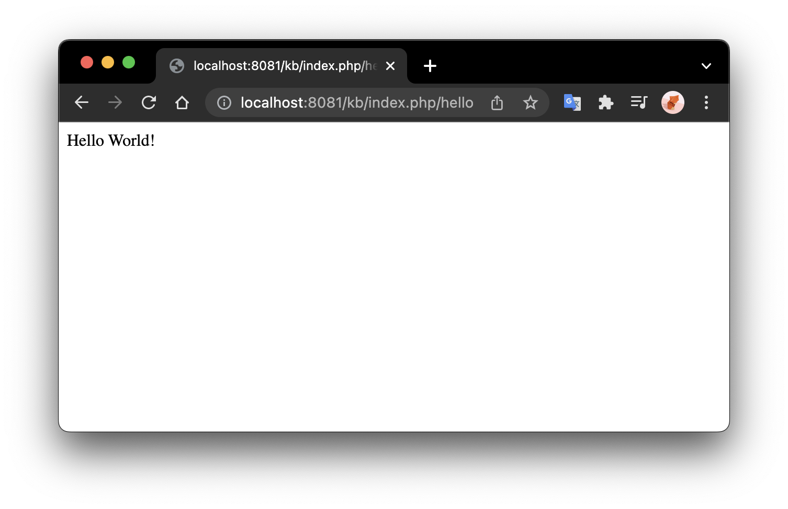
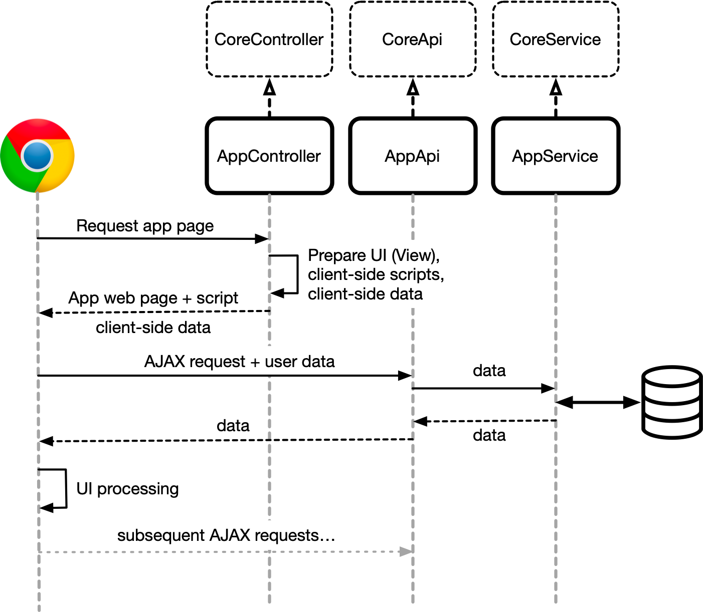

# Develop App with CoreFramework

- Where is the document root location?
- How to access document root from URL using web browser?


xampp/htdocs/kb/

http://localhost/kb/

http://collab.kit-build.net/kb


## Source Files Location

The minimum requirements for developing a web application with CoreFramework is a Controller.

An application source code files should be located in a directory at the **same level** as the `core` directory. CoreFramework will determine an application based on the directory name as its identifier. It is necessary to decide a unique application identifier as a subdirectory under document root of Kit-Build system. 


> **Notes:**
>
> It is recommended to use a short alphabet latin characters for an application identifier name.


If a document root of a Kit-Build system is defined at:

```
/var/www/kb/html
```

and the CoreFramework system files is installed at directory:

```
/var/www/kb/html/core
```

then the source files of an application named `example`  should be located at:

```
/var/www/kb/html/example
```

And a complete CoreFramework web application  `example` has the following directory structures:

```
/example/
|-controller/
|-api/
|-service/
|-model/
|-lib/
|-view/
|-asset/
|-config/
```


## Hello World - ハロワールド

As of this example, the unique application is defined as `hello`. If the document root of the Kit-Build system as defined in the Nginx/Apache configuration is located at:

```
/var/www/kb/html
```

for a HTTP request location of  `/kb`:

```http
http://hostname/kb
```

Therefore, a directory namely `hello` inside the directory: `/var/www/kb/html` is necessary. 

> If you are developing on `localhost`, and you install KB-system directly on document root of `localhost` , then create the new application directory under the document root.


### 1. Creating Application Directory Structure

For a minimum structure, it is only necessary to create a `controller` directory inside the application directory. So, create a directory namely `controller` inside application directory `hello` as follow:

```
/hello/controller/
```


### 2. Create a Default Controller PHP file

Create a default controller file namely `HomeController.php` inside `controller` directory. Then, create a PHP class namely `HomeController` that extends `CoreController` class. Inside the `HomeController` class, create a default method (function) namely `index` like in the following example:

````php
<?php
class HomeController extends CoreController {
  function index() {
    echo "Hello World!";
  }
}
````


### 3. Test the Hello World Application

If the document root can be accessed from URL:

````http
http://hostname/kb
````

Then, the Hello World application can be accessed from the following request URL:

````http
http://hostname/kb/index.php/hello/home/index
````

By default, the framework look for default controller `home` and also default method `index` inside the default controller. If the requested controller and method is found, it will then execute the code inside the requested method.

Requesting the above URL using web browser is the same with requesting the following URL:

````http
http://hostname/kb/index.php/hello
````

> Note that to execute the default controller and method without any parameters, we can ommit the controller and the method name. In this case controller `home` and method `index`




## Understanding the Request Flow and Data Transfer of an Application

With the nature of a client-server web application, the application user interface and interface logic code is served by a web server, while the actual data processing is executed on server. Client "download" the interface and code at the first time they access the web application or when they "change" the page. Afterwards, most of the data exchange between client and server is done by AJAX call using Javascript.




## Requesting Application User Interface Page and Client-side Scripts

Requesting an application page can be performed by either typing the URL address from web browser address bar, clicking a link, or redirect a request from Javascript or server-side script.

### Request URL Format

The request URL, which is understandable by CoreFramework, has the following format standard:

````http
http(s)://hostname/index.php/app/controller/method/arg1/arg2/arg3/...
````

- `hostname`: is the host name that point to the document root where Kit-Build system is located. 

  **Notes:**

  > If the application is served from a different port number than the standard port 80 (HTTP) or 443 (HTTPS). Then the hostname should be appended with `:port`, e.g. `example.com:8081` , `127.0.0.1:8000`.

- `index.php`: is the CoreFramework bootloader, 99% chances you would not need to change this.

- `app`: is the application directory name/identifier.

- `controller`: is the controller name. If the specified controller name in the URL is `home`, then inside the application's `controller` directory, there should be a PHP class of `HomeController` in the `HomeController.php` file.

  > **Notes:** 
  >
  > the first letter of the controller name will be automatically **Capitalized** to reflect the controller class name and **appended** with "Controller" in the class name.
  >
  > `a` controller is refer to `AController` that is located in `AController.php`.
  >
  > `another` controller is refer to `AnotherController` that is located in `AnotherController.php`.

- `method`: is the name of the function or class method inside the specified controller to be executed.

- `arg1`, `arg2`, `arg3`, ... : is the values passed as the arguments to the specified method.

  >  **Notes:**
  >
  > request of `.../method/val1/val2` will execute a method named `method` with `val1` and `val2` as the value of its arguments as below example:
  >
  > 
  >
  > **Warning:**
  >
  > If a method specify a parameter without having default value, PHP will raise a warning that may disrupt the output of the method. 
  >
  > ````php
  > // call to .../method/val1
  > 
  > function method($arg1, $arg2 = "val2", $arg3) {
  >   // will raise warning, because $arg3 does not have a default value 
  >   // and its value is not provided from the call of the URL
  >   echo $arg1; // will contain "val1" string
  >   echo $arg2; // will contain "val2" default value string
  > }
  > ````
  >
  > If the specified argument variable is optional, you should provide a default value to the argument variable.


### Displaying An HTML View

An HTML page can be shown to the web browser by a Controller.A web page can contain HTML codes, PHP scripts, or the combination of both PHP scripts and HTML codes. 

A web page in HTML format (which may also embed PHP script inside the page) can be displayed by the help of a special View object helper (namely `ui`) that is embedded in the CoreController class. 

Because an application controller extends CoreController class, it inherits all CoreController protected and public attributes, including the View object helper  `ui`. The View object helper  `ui` and the loaded PHP+HTML view page represents the View component of the MVC design pattern.

The View object `ui` can be accessed by the following code from an application controller:

````php
$this->ui;
````

Assuming inside application's `view/` directory, there are two view files, i.e., `page.php` and `snippet.php` as the follow directory structure:

````
/app/
|-view/
  |-page.php
  |-snippet.php
````

A PHP+HTML web page `page.php`, which is located in thez application `view/` directory can be shown to the web browser using the following PHP function call:

````php
$this->ui->view('page.php');
````

Subsequently, to show `snippet.php` file, use the same function call after the previous call to the UI's `view()` function.

````php
$this->ui->view('snippet.php');
````

The order on how the `view()` is called will reflect the order of how the content of viewed page is displayed to the web browser. In this case, content of `snippet.php` will be displayed right after `page.php`.

````php
function method() {
  $this->ui->view('page.php');
  $this->ui->view('snippet.php');
}
````

> `sum.php`
>
> By default, when calling the `view()` function, CoreFramework will look for the view files inside application's `view/` directory, unless specified different in the third parameters.

### Daisy Chaining a View

A view can be displayed by not only a controller. A view can display another view using the same function call, but without the need of help from the View object `ui`.

Below approach yields exactly the same output as the previous two subsequent function call to the UI's `view()` function.

````php
function method() {
  $this->ui->view('page.php');
  $this->ui->view('snippet.php');
}
````

is equal with:

````php
// from the app controller
function method() {
  $this->ui->view('page.php');
}
````

````php+HTML
<!-- From the inside of page.php -->
<?php $this->view('snippet.php'); ?>
````

> **Notes:**
>
> Notice that the `view()` function call for `snippet.php`  from the view page `page.php` ommits the `ui` object. This is because the view `page.php` has become the `ui` object itself. Hence, `ui` object is not necessary. However, all methods inside the calling application controller are inaccessible from inside the view page.


### Passing Data to a View

Consider we have several variables to be displayed inside the view, in which the variables is accessible (owned) by the controller. The controller can pass the variables to a view by passing an associative array to the view as follows:

````php
function method() {
  $a = 1;
  $b = 2;
  $data['va'] = $a;
  $data['vb'] = $b;
  $this->view('sum.php', $data);
}
````

Inside the `sum.php` view file, both the values of controller variables `$a` and `$b` can be obtained from the passing associative key name `$va` and `$vb` as the respective variables. They array key name passed to the view will become the variable name inside the view. The data type passed will also be the same as it was in the controller.

````php+HTML
<!-- Inside of sum.php -->
<p>The controller passes the following variables</p>
<p>$va = <?php echo $va; ?></p>
<p>$vb = <?php echo $vb; ?></p>
<p>The sum of both variables is: <?php echo $va + $vb; ?></p>
````


### Defining The Location A View to Load

By default, CoreFramework will look for a view inside the application's `view/` directory. If you want to change the location CoreFramework will look for, use the third parameter of the `view()` function.

Below is the `view()` function template:

````php
function view($view, $data = array(), $options = null);
````

CoreFramework accepts the following constant values as the options:

````php
CoreView::RELATIVE
CoreView::CORE
CoreView::ASSET
CoreView::APP
CoreView::SHARED
````

Assuming an `app` application has the following file structures inside Kit-Build system document root:

````
/   
|-app/
	|-asset/
  |-view/
    |-page.php
    |-sub/
      |-snippet.php
|-core/  
  |-view/
````

Passing the third parameter of the view function will determine the location of the view file to be loaded.

`CoreView::RELATIVE` If the view is loaded from within another view, CoreFramework will load the view file relative to the current location of the current view file.

`CoreView::CORE` CoreFramework will look the view file inside `/core/view/` directory.

`CoreView::ASSET` CoreFramework will look the view file inside application's `asset/` directory.

`CoreView::APP` CoreFramework will look the view relative to application's `app/` (root) directory.

`CoreView::SHARED` CoreFramework will look the view relative to the Kit-Build system's root `/` directory (document root).


### Loading CoreFramework HTML page Boilerplate

Scripts and styles need to be included and loaded from the HTML code for an application to work and be displayed properly. Scripts and styles can be loaded from inside the `<head>` tag of an HTML web page using `<script>` and `<style>` tag respectively. CoreFramework provides easy and convenient script and style loading method from the application controller script. However, in order to provide the feature, an application needs to load CoreFramework's HTML boilerplates.

To load the pre-`<body>` HTML tags use the following script from application controller.

````php
// load <head> boilerplate
$this->ui->view('head.php', null, CoreView::CORE);
// load your view files here...
...
// load scripts and backmatter boilerplate
$this->ui->view('foot.php', null, CoreView::CORE);
````

The loaded `head.php` will generate necessary `<html>` tag preamble, `<head>` parts and the opening `<body>` tag. The `foot.php` will generate the closing `<body>` tag, placeholders for `<script>` tags and the closing `</html>` tag. Therefore, the application's actual view page should be loaded in between the two views.

> Without loading the CoreFramework's `head.php` and `foot.php` bolierplate, the framework cannot load application's style, scripts, and plugins.


### Loading Application's CSS File

Application's CSS files can be loaded using the following function call from application controller:

````php
function useStyle($path, $pad = null, $assetPath = null);
````

- `$path` contains the relative path to CSS file to be loaded inside application's `asset/` directory.
- `$pad` is a string that should be appended after `$path`. It is useful to append random URL query string to prevent file caching of web browser.
- If `$assetPath` value is set, CoreFramework will look for the CSS file relative to the Kit-Build system's root `/` directory (document root).

Example, the following script is called from the application's controller:

````php
$this->ui->useStyle('css/style.css');
````

 CoreFramework will look for a CSS file inside application's `asset/css/` directory.


### Loading Application's Javascript File

Application's Javascript files can be loaded using the following function call from application controller:

````php
function useScript($path, $pad = null, $assetPath = null);
````

- `$path` contains the relative path to Javascript file to be loaded inside application's `asset/` directory.
- `$pad` is a string that should be appended after `$path`. It is useful to append random URL query string to prevent file caching of web browser.
- If `$assetPath` value is set, CoreFramework will look for the Javascript file relative to the Kit-Build system's root `/` directory (document root).

Example, the following script is called from the application's controller:

````php
$this->ui->useScript('js/myapp.js');
````

 CoreFramework will look for a Javascript file inside application's `asset/js/` directory.


### Loading a Plugin: Predefined Set of Javascript and CSS Files of a Javascript/CSS Library

A set or collection of Javascript and/or CSS files as one library or dependency of another library (e.g., Bootstrap, jQuery, or another 3rd party library) can be loaded as a "plugin". If an application requires 3rd party Javascript/CSS library to be loaded during runtime, the library can be loaded as a *plugin*. A library usually consists of several inseparable Javascript and CSS files.  Loading a 3rd party Javascript library will call the `useStyle()` and `useScript()` several times. CoreFramework allows the call to be wrapped into a single `usePlugin()` function call to load all the necessary Javascript and CSS files to run. A set of necessary Javascript and CSS files of a library is defined in the `.shared/config/plugins.ini` file.

Plugins can be loaded using the following function from the application controller:

````php
$this->ui->usePlugin('plugin_key_name');
````

 

Many 3rd party Javascript libraries depends on `jQuery`, loading jQuery multiple times is not a good option to do as it may cause conflict to the script. With CoreFramework `plugin` mechanism, a plugin can define another plugin as their dependency, thus CoreFramework will load the dependency prior loading the plugin and avoids loading the same plugin multiple times.

That way, it is more convenient to wrap the libraries as a plugin and define `jQuery` also as the dependency plugin. Additionally, it is more likely that a library can be used by two or more applications; thus, storing the library in the global `.asset/vendor/` directory is a better option. 


***Example:***

Consider we want to load jQuery library into our web application page, we put the jQuery library file in app `assets/js` directory and we can load it in regular way:

````php
$this->ui->useScript('js/jquery-3.6.0.min.js');
````

However, we can make jQuery as a **plugin** the following way:

1. Move/copy the `jquery-3.6.0.min.js` file to the global asset directory `/.asset/vendor/`.

2. Edit the file `/.shared/config/plugins.ini` and add the following entry

   ````ini
   [jquery]
   path      = ".asset"
   scripts[] = "vendor/jquery-3.6.0.min.js"
   ````

3. Load the jQuery library the following way:

   ````php
   $this->ui->usePlugin('jquery');
   ````

   

***Dependency Example:***

Consider we wanted to load a 3rd party jQuery plugin/extension layout script, called `Muuri` that depends on jQuery. We can make the 3rd party script as a plugin and set the jQuery library as dependency the following way:

1. Download and copy the muuri.js file from

   ````http
   https://raw.githubusercontent.com/haltu/muuri/master/dist/muuri.js
   ````

   to Kit-Build system `/.asset/vendor` directory.

2. Make the Muuri library as a plugin with `muuri` key name.

   ````ini
   [muuri]
   path           = ".asset"
   scripts[]      = "vendor/muuri.js"
   dependencies[] = "jquery"
   ````

   But now add an additional `dependencies[]` entry with `jquery` as its value

3. Load the Muuri library the following way:

   ````php
   $this->ui->usePlugin('muuri');
   ````

   The CoreFramework will load **both** Muuri and jQuery libraries at once.

   > **Notes:**
   >
   > If we use a plugin that depends on another library, we just need to load the depending library and CoreFramework will automatically load all the dependencies.


### Loading Order of Scripts and Plugins

Plugins and scripts are actually loaded in the order they are loaded from the application controller. So following the suggested order is **highly recommended** as best practice:

1. Load the plugins which has the most dependencies first:

   ````php
   $this->ui->usePlugin('plugin1', 'plugin2', ...);
   ````

2. Load application custom Javascript classes after the plugin if (any) as it may depends on the plugins:

   ````php
   $this->ui->useScript('js/my-custom-classes-script.js');
   ````

3. Load application's main entry script where your application starts, so all the libraries and the appication classes were loaded before the main application script begin:

   ````php
   $this->ui->useScript('js/appmain.js');
   ````

   Don't forget to load your ***jQuery-dependent*** main script in the following "**onReady**" function:

   ````js
   // declare app-specific classes outside the onReady... 
   
   $(() => { // this is the onReady function
     
     // put your application start script here...
     
   })
   ````

   So that your application script is executed **only after** the application page HTML code is *ready* to be executed.

### Best Practice in Requesting Application User Interface

Several guidelines to consider when developing an app interface that uses CoreFramework are:

- Controller: Load the necessary plugins and core client's libraries early. The libraries provide essential functions for the interface to communicate with the server and database.
- Controller: Load your application script and style last before you load any view files.
- Controller/View: Load the `head.php` and `foot.php` of the CoreFramework views as the web application HTML boilerplate. So that the client libraries can be loaded into the page by the framework.
- View: Load application's UI between Core's `head.php` and `foot.php`.
- Service: Put your data-related functions on a Service class as a Service.
- File location: If you plan to use your application Controller/API/Service on different application (not a different Kit-Build system) put the files on the respective location inside the `.shared/` directory.

- Use Bootstrap CSS Framework as the base. Kit-Build system UI relies heavily on Bootstrap's CSS classes and utilities. This will also make your application use custom CSS less and use Bootstrap CSS helper classes more.
- Use jQuery Javascript framework to make your client application code (Javascript) much shorter.


