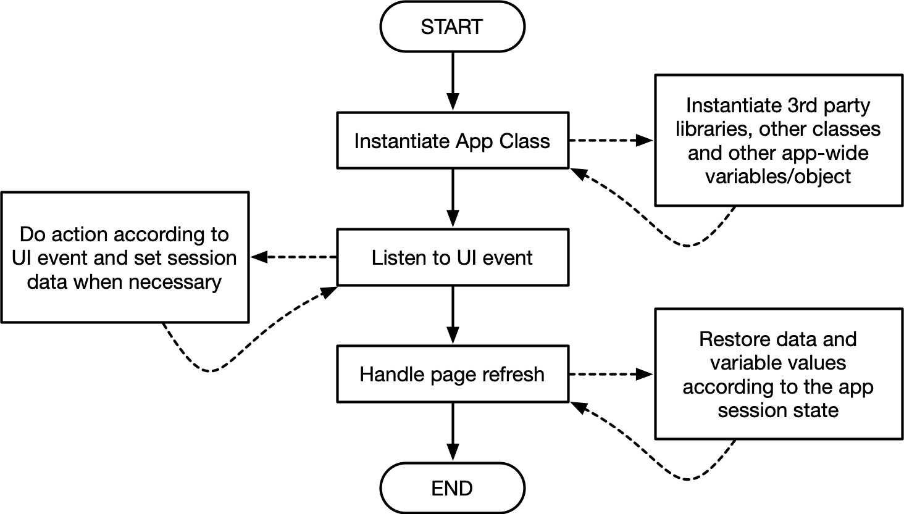

## Developing Application Script

A web application is essentially an HTML page with dynamic content driven by Javascript. There are no strict rules on how to develop a web application. However, in developing application that uses CoreFramework, there are several things to consider in structuring the application code so that your web application is readable and easy to understand. The script is loaded along with the application user interface and starts after the app user interface has finished loading.

The Javascript client-side application code mainly responsible to handle UI event, displaying data obtained from server-side, and do the data communication between client and server using AJAX (library provided by Core-clients library).

As previously mentioned, the entry point of the application Javascript starts from the jQuery "onReady" function. So, jQuery plugin must be loaded from the application controller using the following code:

````php
$this->ui->loadPlugin('jquery');

// load your application script last.
$this->ui->loadScript('js/app-script.js');
````

If your application has a plan to communicate with server to send/retrieve data, the application needs to load the Core-clients scripts from controller before loading any other scripts/plugins the following way:

````php
$this->ui->useCoreClients();
````

> ***Notes:*** 
>
> If you use Core applications core clients script, you don't need to load the jQuery plugin manually because the Core clients depends on jQuery and it will be automatically loaded too.


## Client-App Code Structure

It is not a must but highly recommended that you use the following template structure to write the Javascript application code.

```javascript
$(() => {
  MyApp.instance();
});

class MyApp {
  constructor() {
    this.handleEvent();
    this.handleRefresh();
  }
  
  handleEvent() {
    // do jQuery UI event handling here...
  }
  
  handleRefresh() {
    // do something here when the page is refreshed.
    // as you may need to rebuild your application state
    // based on information stored in session.
  }
  
  // write you other functions here...
  
  static instance() {
    return new MyApp();
  }
  
  // write you other static functions here...
  
}
```

> **Notes:**
>
> Change `MyApp` class name to your application name. Always append you app class name with `App` to avoid conflict with library class names.

Refer to the following diagram for the flow sequence of the client application Javascript code:

